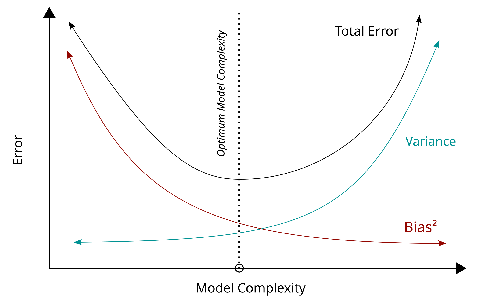
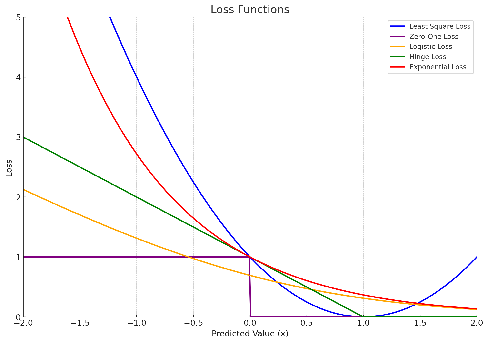
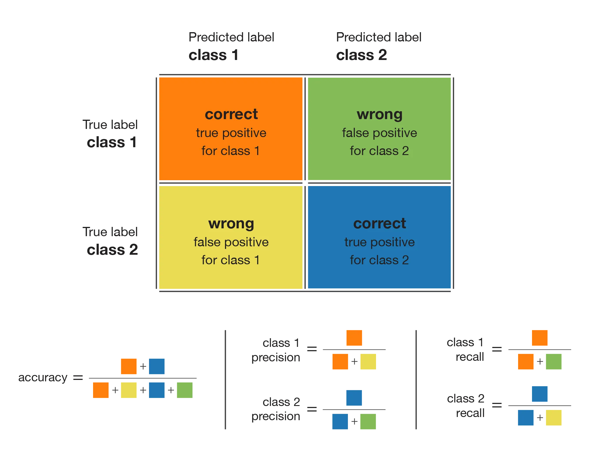
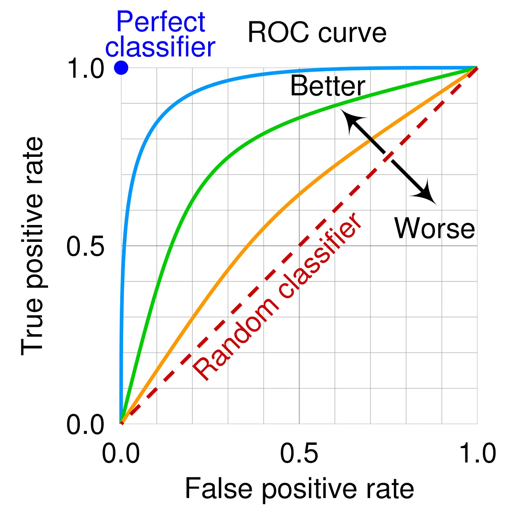
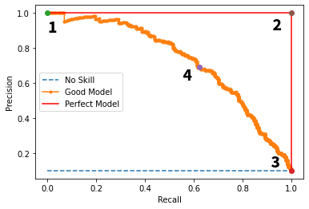

# Part 1: Basic Concepts

## Table of Contents

- [Bias-Variance Tradeoff](#bias-variance-tradeoff)
- [Underfitting vs. Overfitting](#underfitting-vs-overfitting)
    - [Cross-Validation](#cross-validation)
    - [Fixing High Bias (Underfitting)](#fixing-high-bias-underfitting)
    - [Fixing High Variance (Overfitting)](#fixing-high-variance-overfitting)
- [Ensemble Methods](#ensemble-methods)
- [Loss Functions](#loss-functions)
    - [Loss Functions for *Classification*](#loss-functions-for-classification)
    - [Loss Functions for *Regression*](#loss-functions-for-regression)
    - [MLE vs. Loss Functions](#mle-vs-loss-functions)
    - [Batch Learning vs. Online Learning](#batch-learning-vs-online-learning)
- [Confusion Matrix](#confusion-matrix)
    - Accuracy
    - Recall
    - Precision
- [ROC Curves, PR Curves](#roc-curves-pr-curves)

---

## Bias-Variance Tradeoff

Decomposition of **Expected Test Error**:

$$
\begin{align*}
\underbrace{\mathbb{E}_{x, y, D} \left[ \left( h_D(x) - y \right)^2 \right]}_{\text{Expected Test Error}} 
&= \underbrace{\mathbb{E}_{x, D} \left[ \left( h_D(x) - \bar{h}(x) \right)^2 \right]}_{\text{Variance}} 
+ \underbrace{\mathbb{E}_{x, y} \left[ \left( \bar{y}(x) - y \right)^2 \right]}_{\text{Noise}} 
+ \underbrace{\mathbb{E}_x \left[ \left( \bar{h}(x) - \bar{y}(x) \right)^2 \right]}_{\text{Bias}^2}
\end{align*}
$$

- **Variance**: How "over-specialized" (overfitting) is your classifier to a particular training set?
- **Bias**: What is the inherent error that you obtain from your classifier even with infinite training data?
    - Inherent to model
- **Noise**: How big is the data-intrinsic noise?
    - Inherent to data

## Underfitting vs. Overfitting

| **Characteristic**           | **Overfitting**                   | **Underfitting**               |
|------------------------------|-----------------------------------|--------------------------------|
| **Training Error**           | Low                               | High                           |
| **Validation/Test Error**    | High                              | High                           |
| **Model Complexity**         | Too complex                       | Too simple                     |
| **Generalization**           | Poor                              | Poor                           |
| **Bias vs. Variance**        | Low bias, high variance           | High bias, low variance        |

## Cross-Validation

- Algorithm
    1. Split the dataset into **k-folds** (e.g., 5 or 10)
    2. Train the model on $k-1$ folds and validate it on the remaining fold
    3. Repeat the process $k$ times, rotating the validation fold each time
    4. Compute the average training and validation errors across all folds

- Model Generalization Evaluation
    - **Low** training error and **high** validation error → **Overfitting**
    - **High** training error and **high** validation error → **Underfitting**
    - **Similar and low** training and validation errors → **Good generalization**

## Fixing **High Bias** (Underfitting)
1. Increase Model Complexity
2. Decrease Regularization
3. Add Features
4. Increase Training Time
5. Use Non-linear Models

## Fixing **High Variance** (Overfitting)
1. Decrease Model Complexity
2. Increase Regularization
3. Reduce Feature Space
4. Increase Training Data
5. Use Early Stopping
6. Use Ensemble Methods

## Balance: Bias-Variance Tradeoff
The solution often lies in striking a balance between high bias and high variance. You can experiment iteratively with:
- **Model selection**: Trying different algorithms and architectures
- **Hyperparameter tuning**: Adjusting hyperparameters like learning rate, regularization strength, or model depth
- **Feature engineering**: Improving the input data to enhance model performance

## Ensemble Methods

### Pros & Cons
- **(+) Improved accuracy**/predictive performance
- **(+) Improved robustness** to overfitting and noisy data
- **(+) Flexibility** to use different types of models
- (-) Increased complexity (requires more computational resources)
- (-) Harder to interpret compared to a single model

### 1. Bagging (Bootstrap Aggregating)
- Combines bootstrapping with aggregation
    - **Bootstrapping** is a statistical technique used to generate multiple datasets by randomly **sampling (with replacement)** from the original dataset
    - Each bootstrapped dataset is the same size as the original dataset but may contain duplicate samples
- **Reduces variance**

### 2. Boosting
- Training weak learners sequentially to correct errors from the previous one
- **Reduces bias**

### 3. Stacking (Stacked Generalization)
- Improves predictive power by combining predictions from multiple models
- A meta-model is trained on the outputs of base models

### Ensemble Algorithms
1. **Random Forest**: Bagging applied to decision trees
2. **AdaBoost**: Boosting algorithm that combines decision trees or stumps
3. **Gradient Boosting Machines (GBM)**: Sequential training to minimize loss
4. **XGBoost**, **LightGBM**, **CatBoost**: Optimized implementations of gradient boosting with faster training and improved accuracy

## Loss functions

Loss functions provide a mathematical framework to quantify the error between a model's **predictions** and the **true labels**.

- $h_\theta(x)$: **Predicted value** (or raw model output, i.e. **logits**) for a given input $x$
    - $h$: The hypothesis function (i.e., the model)
    - $\theta$: Model parameters (e.g., weights, biases) learned during training
    - $x$: Input features (a single data point or a feature vector)

- $y$: **True value** (or ground truth) corresponding to the input $x$

### Loss Functions for *Classification*

1. **Least Square Loss**: $(h_\theta(x) - y)^2$
    - Smooth and differentiable
    - Highly affected by outliers

2. **Zero-One Loss**: $1\{h_\theta(x) \cdot y \leq 0\}$
    - Rarely used in practice; Non-smooth and difficult to optimize using gradient descent
    - Least sensitive to outliers

3. **Logistic Loss**: $\log(1 + \exp(-h_\theta(x) \cdot y))$
    - Smooth and differentiable, suitable for optimization using gradient descent
    - Commonly used in logistic regression for **binary classification** when $y \in \{-1, 1\}$
    - Operates on **predicted score (logit)** ($h_\theta(x)$) without applying an activation function

4. **Hinge Loss**: $\max\{1 - h_\theta(x) \cdot y, 0\}$
    - Smooth and differentiable, suitable for optimization using gradient descent
    - Commonly used for **SVMs** to maximize the margins

5. **Exponential Loss**: $\exp(-h_\theta(x) \cdot y)$
    - Smooth and differentiable, suitable for optimization using gradient descent
    - Commonly used in boosting algorithms like **AdaBoost**

6. **Cross-Entropy Loss**:
    - Smooth and differentiable, suitable for optimization using gradient descent
    - Operates on **probabilities** ($\hat{y}$), which are derived from the logits using an activation function (e.g., sigmoid or softmax)
    - Used for both **binary and multiclass classification**
        - **For binary classification**: $-[y \log(\hat{y}) + (1 - y) \log(1 - \hat{y})]$
            - $y \in \{0, 1\}$
            - $\hat{y}$ is the predicted probability (output of a sigmoid function)

        - **For multiclass classification**: $-\sum_{i=1}^C y_i \log(\hat{y}_i)$
            - $C$ is the number of classes
            - $y_i$ is the true label (one-hot encoded)
            - $\hat{y}_i$ is the predicted probability (output of a softmax function)

### Loss Functions for *Regression*

1. **Root Mean Square Error (RMSE)**: $RMSE = \sqrt{\frac{1}{n} \sum_{j=1}^n (y_i - \hat{y}_i)^2}$
   - Gives higher weight to large errors, useful when large errors are particularly undesirable

2. **Mean Absolute Error (MAE)**: $MAE = \frac{1}{n} \sum_{i=1}^n |y_i - \hat{y}_i|$
   - Measures the average magnitude of errors **without squaring**
   - Provides a steady metric unaffected by extreme values

3. **RMSE vs. MAE**:
   - RMSE is always greater than or equal to MAE; If all errors are equal, RMSE = MAE
   - MAE is easier to interpret

### MLE vs. Loss Functions

- **MLE (Maximum Likelihood Estimation)** derives loss functions for probabilistic models by: 
    - maximizing the likelihood of the observed data
    - minimizing the negative log-likelihood
- Loss functions are broader and can be used for tasks beyond probability models (e.g., regression, classification)

### Batch Learning vs. Online Learning

1. **Batch Learning**:
   - Learns from all the available training data at once

2. **Online Learning**:
    - Learns gradually, processing one example (or a small batch) at a time as data becomes available
    - **Error-driven approach**, where the model adjusts itself after each new example is received
    - Examples
        - Stock market prediction
        - Email classification
        - Recommendation systems
        - Ad placement in a new market
    - Algorithm
        - **Goal**: Minimize the number of mistakes made by the model over time
        - The process is iterative and works as follows:
            1. Receive an **unlabeled instance** $x^{(i)}$
            2. Predict the output $y' = h_\theta(x^{(i)})$
            3. Receive the **true label** $y^{(i)}$
            4. Suffer a **loss** if the prediction $y' \neq y^{(i)}$
            5. Update the **parameters** $\theta$ to reduce future mistakes

## Confusion Matrix

|                  | Predicted Positive | Predicted Negative |
|------------------|--------------------|--------------------|
| **True Positive**| TP                 | FN                 |
| **True Negative**| FP                 | TN                 |

1. **Accuracy**: $(TP + TN) / \text{all}$
   - Measures how many cases (both positive and negative) are correctly classified

2. **Recall (Sensitivity/True Positive Rate)**: $TP / (TP + FN)$
   - Measures how many actual positive cases are correctly classified
   - Sensitive to imbalanced data

3. **Precision**: $TP / (TP + FP)$
   - Measures how many predicted positive cases are actually correct

|  |  |  |
|--------------------------------|--------------------------------------------------|------------------------|
| **High Recall, Low Precision** | Many false positives but few false negatives     | Good for detection     |
| **Low Recall, High Precision** | Few false positives but many false negatives     | Good for trustworthiness |

4. **F1 Score**: $2 \cdot \frac{\text{recall } \cdot \text{ precision}}{\text{recall } + \text{ precision}}$
   - Harmonic mean of recall and precision, useful for imbalanced datasets

5. **Specificity (True Negative Rate)**: $TN / (TN + FP)$
   - Measures the ability to correctly classify negatives

- Severity of **False Positives vs. False Negatives**:
   - **False Positives** are worse in cases like:
     - Non-contagious diseases (unnecessary treatment)
     - HIV tests (psychological impact)
   - **False Negatives** are worse in cases like:
     - Early treatment importance
     - Quality control defects
     - Software testing (critical errors missed)

## ROC Curves, PR Curves

### ROC (Receiver Operating Characteristic) Curves

- ROC curve plots **recall (TPR)** vs. **1 - specificity (FPR)**
- **AUC (Area Under the Curve)**:
    - AUC near 1 indicates a good model
    - AUC near 0.5 indicates a model performing like random guessing

### Precision-Recall Curves

- PR curves are preferred when the dataset is highly imbalanced or when the focus is on the minority class detection
- Ignores true negatives; Used when classifier specificity is not a concern

- **AUC-PR (Area Under the PR Curve)**:
    - A higher AUC-PR indicates better performance
    - Point 1: **Low Recall, High Precision**
    - Point 2: Perfect model
    - Point 3: **High Recall, Low Precision**
    - Point 4: Trade-off
