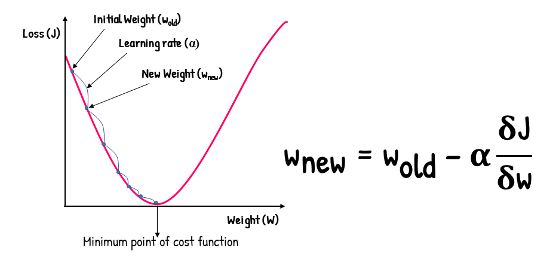

# Part 2: Machine Learning Algorithms

## Table of Contents

- [ML Problem Settings](#ml-problem-settings)
    - [Basic Assumptions and Definitions](#basic-assumptions-and-definitions)
    - [Optimization (Gradient Descent)](#optimization-gradient-descent)
    - [Deterministic & Probabilistic Problems](#deterministic--probabilistic-problems)
    - [Paramertric vs. Nonparametric Models](#paramertric-vs-non-parametric-models)
        - [Parametric Models](#parametric-models)
        - [Nonparametric Models](#nonparametric-models)

    - [Diagnose ML model](#diagnose-ml-model)
    - [Supervised Learning](#supervised-learning)
    - [Decision Tree](#decision-tree)

    - [Unsupervised Learning](#supervised-learning)

---

## ML Problem Settings

### Basic Assumptions and Definitions

1. **Probabilistic Model**: The dataset is considered to be generated from an unknown probability distribution of input-output pairs.

2. **Definition of ML**:
    
    Compute a **function** $f$ that has low expected error $\epsilon$ over **sample** $D$ (from unknown distribution) with respect to **loss function** $L$
    - **Key Assumption**: The target function is unknown
    - **Model**: Defines the hypothesis space for the learning algorithm to search
    - **Model Parameters**: Numerical values or structures used to define hypotheses
    - **Learning Algorithm**: Searches the hypothesis space to minimize loss
    - **Hyperparameters**: Tunable model aspects not selected by the learning algorithm
    - **Inductive Bias**: Assumptions used by the learner to predict outputs of given inputs for unseen data

3. **Structure of ML Algorithm**:
    - **Inputs (features)**: $x^i \in R^n$, $ i = 1, \ldots, m$
    - **Outputs (targets)**: $y^i \in Y, $ $i = 1, \ldots, m$
    - **Parameters**: $ \theta \in R^d$
    - **Hypothesis Function**: $ h_\theta: R^n \to \hat{Y}$
    - **Loss Function**: $ \ell: \hat{Y} \times Y \to R_+$
    - **Canonical Optimization Problem**: $\min_{\theta \in \Theta} \frac{1}{m} \sum_{i=1}^m \ell(h_\theta(x^i), y^i)$

### Optimization (Gradient Descent)

**Gradient Descent** is an iterative optimization algorithm used to find the minimum of a function

- **Algorithm**: Repeatedly update weights by calculating the **negative partial derivatives** for each coordinate
    - **Starting point** ($w_{\text{old}}$): random or zero
    - **Stopping criterion**: Stop when the gradient ($\frac{\partial J}{\partial w}$) becomes close to zero or when the change in $J(w)$ is below a predefined threshold
    - **Learning rate** ($\alpha$): Step size

- Useful in cases where **closed-form solutions** are *unavailable* or *infeasible*
    - Total complexity for OLS: $O(M^2N + M^{2.373})$, where $M$ is the number of features and $N$ is the number of data points

- **Pros**:
    - Simple to implement
    - Widely applicable for a variety of optimization problems

- **Cons**:
    - Slow convergence on large datasets
    - May find local minima instead of global minima
    - May not be suitable for non-convex problems

- **GD Variants**

    

    | Method | Data Processed At a Time | Gradient Quality | Speed | Stability |
    |------------|--------------------|----------------------|-----------|---------------|
    | **Batch GD** | Entire dataset | High (accurate gradients) | Slowest | Very Stable |
    | **Mini-Batch GD** | Batch of data points | Balanced | Balanced | Balanced |
    | **Stochastic GD (SGD)** | Single data point | Noisy (approximate gradients) | Fastest | Less Stable |
    
- **Appendix**: Complexity of matrix operations:
    - Inner product $x^T y$: $O(n)$
    - Matrix-vector product $Ax$: $O(n^2)$
    - Matrix-matrix product $AB$: $O(n^3)$
    - Matrix inverse $A^{-1}$: $O(n^3)$

## Deterministic & Probabilistic Problems

[TODO]

## Paramertric vs. Nonparametric Models

### Parametric Models
- **Characteristics**:
    - Assume a specific distribution for the data
    - Have a fixed number of parameters
    - Complexity of the model is **bounded**, regardless of the amount of data

- **Examples**:
    - Linear Regression
    - Logistic Regression
    - Linear SVM
    - K-Means Clustering
    - PCA

### Nonparametric Models
- **Characteristics**:
    - Do not make strong assumptions about the underlying function
    - The number of parameters grows with the size of the training data
    - More flexible but **require more training data**

- **Examples**:
    - K-Nearest Neighbor (k-NN)
    - Decision Trees
    - RBF Kernel SVMs
    - Gaussian Processes (GPs)

## Diagnose ML model

[TODO]

## Supervised Learning

| **Algorithm**             | **Hypothesis**                   | **Loss Function**                           | **Optimization Method**    |
|---------------------------|----------------------------------|---------------------------------------------|----------------------------|
| **Linear Regression**     | Linear                           | Any regression loss                         | Any                        |
| **SVM**                   | Linear or kernel                 | Hinge loss                                  | Any                        |
| **Logistic Regression**   | (Usually) linear                 | Logistic loss                               | Any                        |
| **NN (Neural Networks)**  | Composed non-linear function     | Any                                         | (Usually) gradient descent |
| **DT (Decision Tree)**    | Axis-aligned halfplanes          | Log probability under Bernoulli model       | Greedy search              |
| **Naive Bayes**           | Linear                           | Joint probability of data and output        | Analytic solution          |
| **Gradient Boosting**     | Ensemble of other models         | Any                                         | Gradient descent           |

---

## Decision Tree

### Pros
- Easy to interpret and visualize
- Computationally efficient in both time and memory
- Widely applicable to classification, regression, and density estimation

### Algorithm
1. Search for the best attribute (**splitting criterion**) to split the data
2. Use the chosen attribute to split data into subsets
3. Repeat steps 1 and 2 for each subset until **stopping criteria** are met
4. Optionally **prune** the tree to prevent overfitting

- **Complexity**:
    - Training: $O(MN \log N)$
    - Prediction: $O(2^M \log N)$

### Splitting Criteria in Decision Trees

Splitting criteria determine the best way to split data at each node of the tree.

1. **Information Gain**

    - Measures the reduction in entropy (uncertainty)
    
    - **Goal**: Choose the attribute that *maximizes* the information gain after the split

        

        $$
        IG(S, A) = Entropy(S) - \sum_{i} \frac{|S_i|}{|S|} \cdot Entropy(S_i)
        $$
        

        where:
        - $S$: Original dataset
        - $A$: Attribute being split
        - $S_i$: Subset created by splitting $S$ on $A$

    - **Entropy** (for classification problems):

        

        $$
        Entropy(S) = -\sum_{j} p_j \log_2(p_j)
        $$
        

        
        where $p_j$ is the proportion of class $j$ in the dataset

    - **(+)**: Works particularly well for multi-class problems

2. **Gini Index**

    - Measures the impurity of a dataset

    - **Goal**: Choose the attribute that *minimizes* the Gini Index after the split

    - **Formula**:
        

        $$
        Gini(S) = 1 - \sum_{j} p_j^2
        $$
        

        where $p_j$ is the proportion of class $j$ in the dataset

    - **(+)**: Computationally efficient and widely used in practical implementations, especially in CART (Classification and Regression Trees)

3. **Error Rate**
    - Measures the misclassification error of a split

    - **Goal**: Choose the attribute that *minimizes* the error rate after the split

    - **Formula**:
        

        $$
        Error\ Rate(S) = 1 - \max(p_j)
        $$
        

        
        where $p_j$ is the proportion of the majority class in the dataset

    - **(-)**: Less sensitive to changes in data distribution compared to Information Gain or Gini Index and rarely used in practice

### Stopping Criteria
- Splitting criterion falls below a threshold
- Maximum tree depth is achieved
- Split is not statistically significant
- Full tree is grown, then pruned

### Pruning
1. Prepare a validation set to evaluate the impact of pruning
2. Greedily remove nodes that improve validation accuracy
3. Stop pruning when further pruning is detrimental

### Inductive Bias in Decision Trees

- **ID3 Algorithm** (Greedy Search):
    - **Smallest Tree**: Assumes that smaller trees are better generalizations and less likely to overfit
    - **High Mutual Information**: Favors splitting on attributes that provide the most information gain (reduce uncertainty the most) near the root of the tree, ensuring that the most informative decisions are made early

---

## Random Forest

