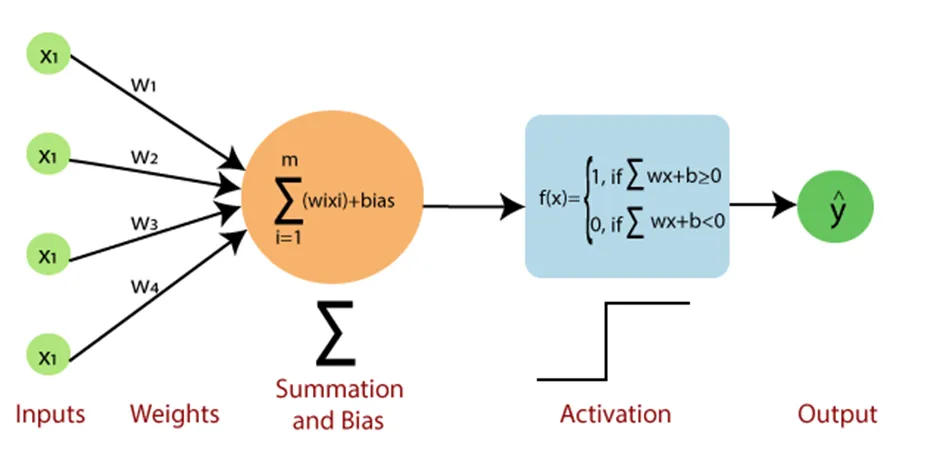

# Part 2: Machine Learning Algorithms

## Table of Contents

- [ML Problem Settings](#ml-problem-settings)
    - [Basic Assumptions and Definitions](#basic-assumptions-and-definitions)
    - [Optimization (Gradient Descent)](#optimization-gradient-descent)
- [Deterministic & Probabilistic Problems](#deterministic--probabilistic-problems)
- [Paramertric vs. Nonparametric Models](#paramertric-vs-non-parametric-models)
    - [Parametric Models](#parametric-models)
    - [Nonparametric Models](#nonparametric-models)

- [Diagnose ML model](#diagnose-ml-model)
- [Supervised Learning](#supervised-learning)
    1. [Decision Tree (DT)](#decision-tree)
        - [Random Forest (RF)](#random-forest-rf)
        - [Boosting Regression Trees (Gradient Boosting)](#boosting-regression-trees-gradient-boosting)
        - [Boosting Classification Trees (AdaBoost)](#boosting-classification-trees-adaboost)
    2. [KNN (K-Nearest Neighbors) Classification](#knn-k-nearest-neighbors-classification)
    3. [Perceptron](#perceptron)
    4. [Linear Regression](#linear-regression)
        - [Regularization](#regularization)
            - Ridge Regression (L2 Regularization)
            - Lasso Regression (L1 Regularization)
    5. [Logistic Regression](#logistic-regression)
    6. [Neural Network](#neural-network)
    7. [Navie Bayes](#naive-bayes)
    8. [SVM](#svm)
    9. [K-Means Clustering](#k-means-clustering)
    10. [Time Series Forecasting](#time-series-forecasting)
---

## ML Problem Settings

### Basic Assumptions and Definitions

1. **Probabilistic Model**: The dataset is considered to be generated from an unknown probability distribution of input-output pairs.

2. **Definition of ML**:
    
    Compute a **function** $f$ that has low expected error $\epsilon$ over **sample** $D$ (from unknown distribution) with respect to **loss function** $L$
    - **Key Assumption**: The target function is unknown
    - **Model**: Defines the hypothesis space for the learning algorithm to search
    - **Model Parameters**: Numerical values or structures used to define hypotheses
    - **Learning Algorithm**: Searches the hypothesis space to minimize loss
    - **Hyperparameters**: Tunable model aspects not selected by the learning algorithm
    - **Inductive Bias**: Assumptions used by the learner to predict outputs of given inputs for unseen data

3. **Structure of ML Algorithm**:
    - **Inputs (features)**: $x^i \in R^n$, $ i = 1, \ldots, m$
    - **Outputs (targets)**: $y^i \in Y, $ $i = 1, \ldots, m$
    - **Parameters**: $ \theta \in R^d$
    - **Hypothesis Function**: $ h_\theta: R^n \to \hat{Y}$
    - **Loss Function**: $ \ell: \hat{Y} \times Y \to R_+$
    - **Canonical Optimization Problem**: $\min_{\theta \in \Theta} \frac{1}{m} \sum_{i=1}^m \ell(h_\theta(x^i), y^i)$

### Optimization (Gradient Descent)

**Gradient Descent** is an iterative optimization algorithm used to find the minimum of a function

- **Algorithm**: Repeatedly update weights by calculating the **negative partial derivatives** for each coordinate
    - **Starting point** ($w_{\text{old}}$): random or zero
    - **Stopping criterion**: Stop when the gradient ($\frac{\partial J}{\partial w}$) becomes close to zero or when the change in $J(w)$ is below a predefined threshold
    - **Learning rate** ($\alpha$): Step size

- Useful in cases where **closed-form solutions** are *unavailable* or *infeasible*
    - Total complexity for OLS: $O(M^2N + M^{2.373})$, where $M$ is the number of features and $N$ is the number of data points

- **Pros**:
    - Simple to implement
    - Widely applicable for a variety of optimization problems

- **Cons**:
    - Slow convergence on large datasets
    - May find local minima instead of global minima
    - May not be suitable for non-convex problems

- **GD Variants**

    

    | Method | Data Processed At a Time | Gradient Quality | Speed | Stability |
    |------------|--------------------|----------------------|-----------|---------------|
    | **Batch GD** | Entire dataset | High (accurate gradients) | Slowest | Very Stable |
    | **Mini-Batch GD** | Batch of data points | Balanced | Balanced | Balanced |
    | **Stochastic GD (SGD)** | Single data point | Noisy (approximate gradients) | Fastest | Less Stable |
    
- **Appendix**: Complexity of matrix operations:
    - Inner product $x^T y$: $O(n)$
    - Matrix-vector product $Ax$: $O(n^2)$
    - Matrix-matrix product $AB$: $O(n^3)$
    - Matrix inverse $A^{-1}$: $O(n^3)$

## Deterministic & Probabilistic Problems

[TODO]

## Paramertric vs. Nonparametric Models

### Parametric Models
- **Characteristics**:
    - Assume a specific distribution for the data
    - Have a fixed number of parameters
    - Complexity of the model is **bounded**, regardless of the amount of data

- **Examples**:
    - Linear Regression
    - Logistic Regression
    - Linear SVM
    - K-Means Clustering
    - PCA

### Nonparametric Models
- **Characteristics**:
    - Do not make strong assumptions about the underlying function
    - The number of parameters grows with the size of the training data
    - More flexible but **require more training data**

- **Examples**:
    - K-Nearest Neighbor (k-NN)
    - Decision Trees
    - RBF Kernel SVMs
    - Gaussian Processes (GPs)

## Diagnose ML model

[TODO]

## Supervised Learning

| **Algorithm**             | **Hypothesis**                   | **Loss Function**                           | **Optimization Method**    |
|---------------------------|----------------------------------|---------------------------------------------|----------------------------|
| **Linear Regression**     | Linear                           | Any regression loss                         | Any                        |
| **SVM**                   | Linear or kernel                 | Hinge loss                                  | Any                        |
| **Logistic Regression**   | (Usually) linear                 | Logistic loss                               | Any                        |
| **NN (Neural Networks)**  | Composed non-linear function     | Any                                         | (Usually) gradient descent |
| **DT (Decision Tree)**    | Axis-aligned halfplanes          | Log probability under Bernoulli model       | Greedy search              |
| **Naive Bayes**           | Linear                           | Joint probability of data and output        | Analytic solution          |
| **Gradient Boosting**     | Ensemble of other models         | Any                                         | Gradient descent           |

---

## Decision Tree (DT)

### Pros
- Easy to interpret and visualize
- Computationally efficient in both time and memory
- Widely applicable to classification, regression, and density estimation

### Algorithm
1. Search for the best attribute (**splitting criterion**) to split the data
2. Use the chosen attribute to split data into subsets
3. Repeat steps 1 and 2 for each subset until **stopping criteria** are met
4. Optionally **prune** the tree to prevent overfitting

- **Complexity**:
    - Training: $O(MN \log N)$
    - Prediction: $O(2^M \log N)$

### Splitting Criteria in Decision Trees

Splitting criteria determine the best way to split data at each node of the tree.

1. **Information Gain**

    - Measures the reduction in entropy (uncertainty)
    
    - **Goal**: Choose the attribute that *maximizes* the information gain after the split

        

        $$
        IG(S, A) = Entropy(S) - \sum_{i} \frac{|S_i|}{|S|} \cdot Entropy(S_i)
        $$
        

        where:
        - $S$: Original dataset
        - $A$: Attribute being split
        - $S_i$: Subset created by splitting $S$ on $A$

    - **Entropy** (for classification problems):

        

        $$
        Entropy(S) = -\sum_{j} p_j \log_2(p_j)
        $$
        

        
        where $p_j$ is the proportion of class $j$ in the dataset

    - **(+)**: Works particularly well for multi-class problems

2. **Gini Index**

    - Measures the impurity of a dataset

    - **Goal**: Choose the attribute that *minimizes* the Gini Index after the split

    - **Formula**:
        

        $$
        Gini(S) = 1 - \sum_{j} p_j^2
        $$
        

        where $p_j$ is the proportion of class $j$ in the dataset

    - **(+)**: Computationally efficient and widely used in practical implementations, especially in CART (Classification and Regression Trees)

3. **Error Rate**
    - Measures the misclassification error of a split

    - **Goal**: Choose the attribute that *minimizes* the error rate after the split

    - **Formula**:
        

        $$
        Error\ Rate(S) = 1 - \max(p_j)
        $$
        

        
        where $p_j$ is the proportion of the majority class in the dataset

    - **(-)**: Less sensitive to changes in data distribution compared to Information Gain or Gini Index and rarely used in practice

### Stopping Criteria
- Splitting criterion falls below a threshold
- Maximum tree depth is achieved
- Split is not statistically significant
- Full tree is grown, then pruned

### Pruning
1. Prepare a validation set to evaluate the impact of pruning
2. Greedily remove nodes that improve validation accuracy
3. Stop pruning when further pruning is detrimental

### Inductive Bias in Decision Trees

- **ID3 Algorithm** (Greedy Search):
    - **Smallest Tree**: Assumes that smaller trees are better generalizations and less likely to overfit
    - **High Mutual Information**: Favors splitting on attributes that provide the most information gain (reduce uncertainty the most) near the root of the tree, ensuring that the most informative decisions are made early

---

## Random Forest (RF)

Random Forest is an **ensemble method** that combines multiple decision trees
using **bagging** and **feature randomness** to create a forest of uncorrelated trees

### Random Forest Process

- **Bootstrap Sampling (Bagging)**:
    - Draw a bootstrap dataset $D_b$ of size $n$ from training data $D$
    - Grow a decision tree $T_b$ using $D_b$ by:
        1. Selecting $p$ (typically $p \approx \sqrt{d}$) random features from $d$
            - Equivalent to vanilla bagging when $p = d$
        2. Choosing the best feature among $p$ to split
        3. Recursively splitting until the stopping criterion is met (e.g., minimum leaf size)
- **Output**: An ensemble of trees $\{T_1, T_2, \dots, T_B\}$

### Out-of-Bag (OOB) Score
- **Bootstrap Sampling**: Each decision tree is trained on a randomly sampled subset of the training data (with replacement)
- On average, 63% of the original data is included in each bootstrap sample for training, while 37% of the data is left out as **out-of-bag (OOB) samples**
- OOB score is calculated as:
    - the mean squared error (MSE) (for regression)
    - the accuracy (for classification)
- OOB score serves as an **unbiased estimate** of the Random Forest's generalization error without the need for additional validation datasets

### Interpretability and Feature Importance

- **Trade-off**: Bagging improves prediction accuracy but reduces interpretability
- **Feature Importance**
    - For regression trees: Calculated as the **total reduction in RSS** (Residual Sum of Squares) due to splits involving a feature, averaged across all $B$ trees
    - For classification trees: Measured by the **total decrease in impurity** (e.g., Gini index) caused by splits involving a feature, averaged over all $B$ trees
- Features are ranked by the average contribution to the measures, where higher values indicate greater importance

### Advantages of Random Forest
1. Handles missing values and outliers
2. Less prone to overfitting; Low bias and moderate variance
3. Generalizes to high-dimensional data and correlated features
4. Robust to data variations and non-linear patterns
5. Can be trained in parallel for efficiency
6. Does not require cross-validation to estimate error

---

## Boosting Regression Trees (Gradient Boosting)

- Boosting mirrors human learning by iteratively improving performance on challenging examples
- Examples: XGBoost, LightGBM, CatBoost

### Steps to Build Boosted Regression Trees

1. Initialize:
    - $f(x) = 0$ and residuals $r_i = y_i$ for all instances $i$ in the training set $(X, y)$
2. For each boosting iteration $b = 1, \dots, B$:
    1. Fit a regression tree $T_b$ to the training data $(X, r)$
        - The tree predicts $f_b(x)$ for an instance $x$
    2. Update the prediction model:
        - $f(x) \leftarrow f(x) + \lambda f_b(x)$, where $\lambda$ is the learning rate
    3. Update the residuals:
        - $r_i \leftarrow r_i - \lambda f_b(x_i)$
3. Output the final boosted regression model:
    - $f(x) = \sum_{b=1}^B \lambda f_b(x)$

### Hyperparameters
1. **Number of Trees ($B$):**
    - Controls the size of the ensemble
    - **Too large** $B$ may lead to overfitting

2. **Learning Rate ($\lambda$):**
    - Controls how much each tree contributes to the final model
    - **Small $\lambda$** requires more iterations but improves model performance

3. **Regularization Parameter ($h_\text{max}$ or $n_\text{min}$):**
    - Limits tree complexity (e.g., maximum depth or minimum leaf size)
    - Smaller trees reduce overfitting but may require a larger $B$

Practical Tips

- Hyperparameter tuning often involves cross-validation over:
    - A 3D grid of $B$, $\lambda$, and $h_\text{max}$
    - Alternatively, fixing $B$ and searching over $\lambda$ and $h_\text{max}$ (2D grid)

---

## Boosting Classification Trees (AdaBoost)

### AdaBoost Process

- Initialize the weights $ \beta_i^{(0)} = 1/n $ for training instances $ i = 1, \dots, n $ where $ y_i \in \{-1, +1\} $
- For $ b = 1, \dots, B $:
    1. Fit a decision tree $ T_b $ to training data using weights $ \beta_i^{(b)} $. Denote the prediction function of $ T_b $ as $ f_b : \mathbf{x} \to \{-1, +1\} $
    2. Compute training error rate for $ f_b $ on the weighted data:  
        

        $$
        \text{error}_b = \frac{\sum_{i=1}^n \beta_i \cdot \mathbb{I}(y_i \neq f_b(x_i))}{\sum_{i=1}^n \beta_i}
        $$
        

    3. Compute classifier weight $ \alpha_b $ for $ f_b $:  
        

        $$
        \alpha_b = \frac{1}{2} \log \left( \frac{1 - \text{error}_b}{\text{error}_b} \right)
        $$
        

    4. Update weights of training instances:  
        

        $$
        \beta_i^{(b)} \gets \frac{\beta_i^{(b-1)} \cdot \exp \left[ -\alpha_b \cdot y_i \cdot f_b(x_i) \right]}{\sum_{i=1}^n \beta_i^{(b-1)} \cdot \exp \left[ -\alpha_b \cdot y_i \cdot f_b(x_i) \right]}, \quad i = 1, \dots, n
        $$
        

- Output the boosted classification model:  
    

    $$
    f(\mathbf{x}) = \text{sign} \left( \sum_{b=1}^B \alpha_b f_b(\mathbf{x}) \right)
    $$
    

---

## KNN (K-Nearest Neighbors) Classification

### Algorithm
1. **Training**: Store the dataset $D$
    - $O(1)$

2. **Prediction**: Assign the **most common label** (majority vote) of the $K$-nearest points in $D$ to a given input based on the computed distances

    - $O(MN)$, where $M$ is the number of features and $N$ is the size of the dataset

    - **Behavior with $K$**:
        - Small $K$: Model may overfit
        - Large $K$: Majority vote in $D$ dominates

### Distance Functions

1. **Euclidean Distance**:
    

    $$
    g(u, v) = \sqrt{\sum_{m=1}^{M} (u_m - v_m)^2}
    $$
    

2. **Manhattan Distance**:
    

    $$
    g(u, v) = \sum_{m=1}^{M} |u_m - v_m|
    $$
    

### Tuning
1. Use different distance functions
2. Increase $K$
3. Remove the farthest point
4. Apply weighted voting (give closer points higher weight)

### Inductive Bias in KNN
1. Assumes that **nearby points** are likely to have **similar labels**
2. Assumes **equal importance** for all features (can degrade performance in high-dimensional datasets and lead to the curse of dimensionality)

---

## Perceptron

**Perceptron** is a foundational machine learning model designed for **binary classification** tasks
- Uses **weights** for features to learn a **linear decision boundary**
- Features with larger absolute weights have greater influence on prediction (requires feature scaling)

### Algorithm
1. Initialize:
    - Set all weights ($\theta$) to zero
2. While not converged:
    - For each training example $(x^i, y^i)$:
        - Predict $\hat{y} = h_\theta(x) = \text{sign}(\theta^T x)$
        - If $\hat{y} \neq y$, update weights:
            $\theta \gets \theta + y^i x^i$

### Perceptron Mistake Bound
- If data has a margin $\gamma$ and is within a radius $R$, the Perceptron makes at most $(R / \gamma)^2$ mistakes
- **Scaling Invariance**: Scaling all inputs does not affect the number of mistakes

### Inductive Bias in Perceptron
- Assumes **linear decision boundaries**
- Prioritizes correcting the **most recent mistakes** (suitable for online learning)

### Extensions
1. **Voted Perceptron**:
    - Stores all weight vectors during training; Allows weighted voting
    - Improves generalization but memory-intensive
2. **Averaged Perceptron**:
    - Uses running averages of weights for memory efficiency
3. **Kernel Perceptron**:
    - Uses the **kernel trick** to handle non-linear decision boundaries
4. **Structured Perceptron**:
    - Designed for tasks with exponentially large output spaces

---

## Linear Regression

- **Linear Regression** models the relationship between variables with an **affine combination** (linear combination where the coefficients (weights) sum to 1)

- Closed-form solution:  
    

    $$ \theta = (X^T X)^{-1} X^T y $$
    

### Assumptions
1. **Linear Relationship**: Independent variables are assumed to have a linear relationship with the dependent variable
2. **Normal Residuals**: Residuals should follow a normal distribution (check via Q-Q plot)
3. **No Multicollinearity**: Independent variables should not be highly correlated to ensure stable coefficient estimates
4. **Homoscedasticity**: Error variance should be constant across all predictor levels
5. **Independent Residuals**: Observations should be randomly and independently sampled

### Data Preparation
1. Address non-linear relationships (e.g., log transformation for an exponential relationship) 
2. Clean data to remove noise
3. Remove highly correlated variables
4. Standardize variables for better predictions

### Intercept Term
The **intercept term** in a regression model ensures that:

1. **Residuals have zero mean**: The average difference between the observed values and the predicted values is zero, which prevents systematic overestimation or underestimation of the dependent variable

2. **Unbiased slope estimates**: The inclusion of an intercept allows the regression line to fit the data accurately, ensuring that the estimated slope coefficients are not distorted by forcing the line to pass through the origin

### Model Evaluation
- **R-squared/Adjusted R-squared**
- **F-test**
    - Null Hypothese $H_0$: All regression coefficients are equal to zero
- **RMSE**

### Regularization

**Regularization** involves adding a **penalty term** to the loss function in regression models to prevent overfitting and enhance generalization

1. **Ridge Regression (L2 Regularization)**

    - Penalizes the sum of squared coefficients ($\|\mathbf{w}\|_2^2 = \sum_j w_j^2$)

    - Loss function:
        

        $$
        \ell(\mathbf{w}) = \frac{1}{2} \|\mathbf{Xw} - \mathbf{y}\|^2 + \frac{\lambda}{2} \|\mathbf{w}\|_2^2
        $$
        

    - Closed-form solution:
        

        $$
        \mathbf{w} = (\mathbf{X}^T \mathbf{X} + \lambda \mathbf{I})^{-1} \mathbf{X}^T \mathbf{y}
        $$
        

2. **Lasso Regression (L1 Regularization)**
    - Penalizes the absolute sum of coefficients ($\|\mathbf{w}\|_1 = \sum_j |w_j|$)
    - Encourages sparsity by driving some coefficients to zero, enabling feature selection
    - No closed-form solution due to the non-differentiability of $\|\mathbf{w}\|_1$ at $w_j = 0$
    - Requires **subgradient optimization** techniques for implementation

Practical Tips

- Proper selection of $\lambda$ balances bias and variance, optimizing model performance
    - **$\lambda = 0$**: No regularization, reduces to standard least squares regression, might lead to overfitting
    - **$\lambda \to \infty$**: Coefficients approach zero, might lead to underfitting

---

## Logistic Regression

**Logistic Regression** predicts the probability of a **binary outcome** using a linear combination of independent variables transformed by a **logit function**

- Commonly known as the **logit model**, a probabilistic classifier optimized through **MLE**
- Shares similarities with SVMs in separating hyperplanes, but differs in loss function

### Algorithm

- **Hypothesis Function**:
    

    $$
    p(y=1|x) = \frac{1}{1 + e^{-\theta^T x}}
    $$
    

    
    - Models conditional probability using **logits** ($\theta^T x$)

- **Loss Function**:
    - **Logistic Loss (log-loss)**: $\log(1 + e^{-h_\theta(x) \cdot y})$
    - Optimized using **gradient descent**

### Multi-class Logistic Regression
- **"One-vs-All" Method**: Creates $k$ binary classifiers for $k$ classes
- **Loss Function**:
    - **Softmax Loss**: $p(y|x) = \frac{e^{\theta_k^T x}}{\sum_{k=1}^K e^{\theta_k^T x}}$
    - Optimized using **MLE**

---

## Neural Network

---

## Navie Bayes

---

## SVM

---

## K-Means Clustering

---

## Time Series Forecasting

---

[Back to top](#top)
